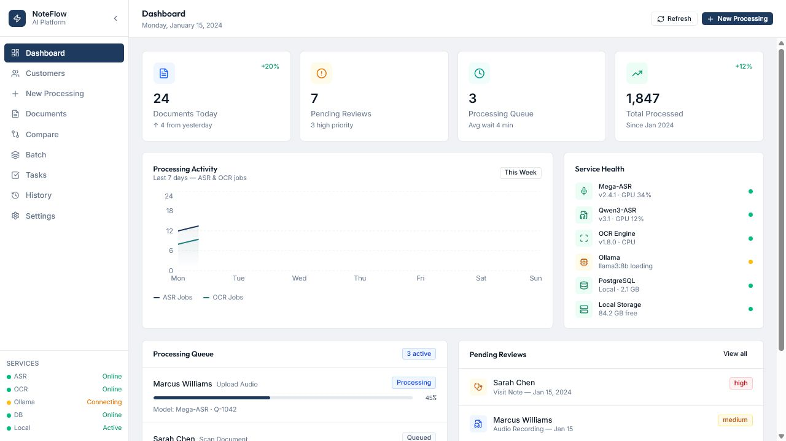

# NoteFlow AI

Local-first documentation workflow prototype for turning text, audio, and scanned documents into reviewable records.

> **Prototype only.** Every record shown in the interface and screenshots is synthetic demo data. NoteFlow is not a diagnosis, treatment, or clinical decision system and has not been validated for real-world medical use.



## Why it exists

Documentation pipelines often hide model failures behind a single generated output. NoteFlow keeps source material, model output, corrections, confidence, and reviewer actions visible so experiments can be inspected and reproduced.

## What works

- FastAPI API with authenticated local sessions and ownership checks
- Manual note, ASR, and OCR ingestion paths
- Correctable document records with audit history
- WER/CER and numeric mismatch comparison
- Documentation checks, follow-up tasks, and exports
- React/Vite workflow UI
- Backend tests plus frontend lint, type checking, test, and build gates

## Quick start

Prerequisites: Python 3.11+, Node.js 22+, and pnpm 10+.

```bash
cp .env.example .env

cd backend
python -m venv .venv
# Windows: .venv\Scripts\activate
# macOS/Linux: source .venv/bin/activate
pip install -r requirements.txt
alembic upgrade head
uvicorn app.main:app --reload
```

In another terminal:

```bash
cd Frontend
pnpm install
pnpm dev
```

Open `http://localhost:5173`. The development credentials are configured in `.env`.

Model runtimes are optional. Install `backend/requirements-models.txt` when exercising PaddleOCR and point the model variables in `.env` at local checkpoints. Private Mega-ASR code and checkpoints are not included.

## Verify

```bash
python -m pytest backend/tests
cd Frontend && pnpm lint && pnpm typecheck && pnpm test && pnpm build
```

## Architecture

```text
React/Vite UI
    │ REST /api
FastAPI
    ├── SQLAlchemy + SQLite/PostgreSQL
    ├── local upload/export storage
    ├── optional ASR/OCR/Ollama adapters
    └── comparison, review, task, audit, and export services
```

See [architecture](docs/ARCHITECTURE.md), [project status](docs/STATUS.md), and [privacy/safety boundaries](docs/PRIVACY.md).

## Known limitations

- Prototype security defaults are for local development, not deployment.
- The UI still mixes live API data with explicitly labeled synthetic fixtures.
- Model checkpoints and private research code are not distributed.
- No clinical, privacy, robustness, or performance validation is claimed.
- There is no repository license; reuse permission has not been granted.
