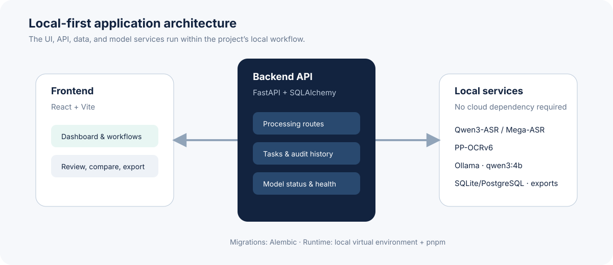
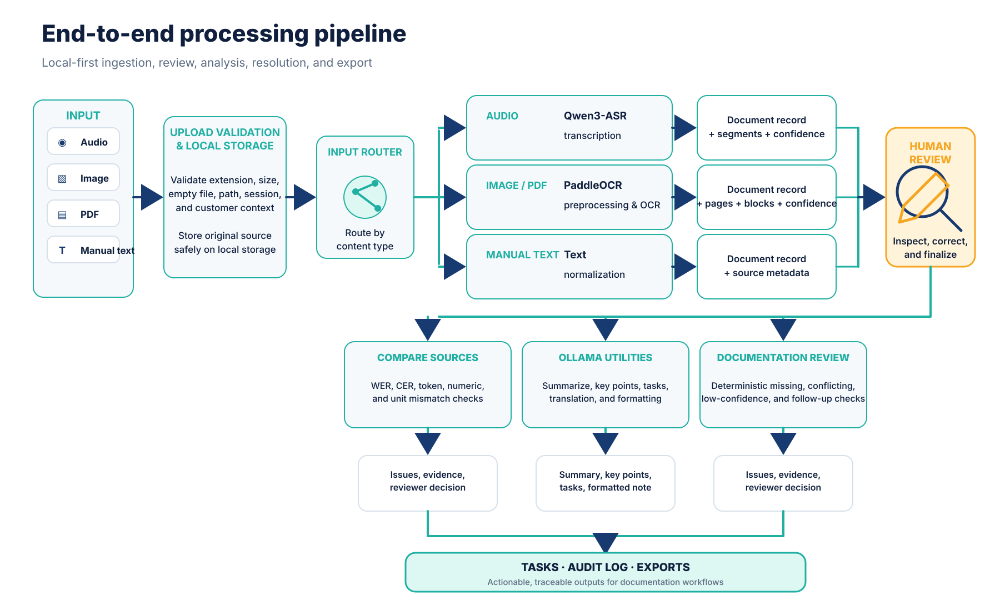
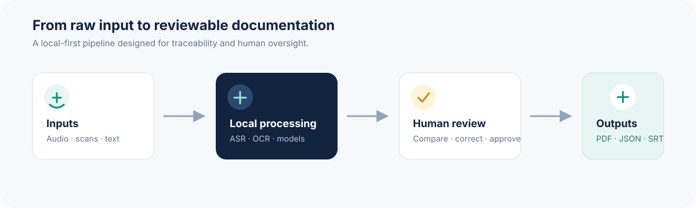

# NoteFlow AI

**A local-first documentation-support prototype that turns manual notes, audio recordings, and scanned documents into structured, reviewable, and auditable workflows.**

`Status: Prototype` · `Scope: Documentation support` · `Data: Local-first`

> **Safety scope:** NoteFlow AI is **not** a medical diagnosis or treatment system. It does not replace qualified human judgment. Any real-world clinical use would require validated model behavior, privacy controls, production security hardening, and review by appropriately qualified professionals.


*Audio, scanned documents, and manual text converge into a reviewable document workflow.*

---

## Overview

NoteFlow AI accepts manual text and source material, processes audio through ASR and scanned content through OCR, stores normalized document records, and supports the work that follows: correction, comparison, deterministic documentation checks, issue resolution, follow-up tasks, audit history, and export.

The backend is the system of record. Automated results remain visible and correctable, and source material is preserved so reviewers can trace how a final document was produced.

### Core capabilities

| Area | Purpose |
| --- | --- |
| Customer management | Create, search, update, archive, restore, and export customer records. |
| Document ingestion | Add manual notes, audio recordings, images, and scanned documents. |
| ASR and OCR | Process audio with local ASR adapters and images/documents with local OCR adapters. |
| Normalization | Store source text, corrected text, language, confidence, metadata, warnings, ASR segments, and OCR blocks. |
| Human review | Correct full document text or individual OCR blocks while preserving the original source. |
| Comparison | Calculate WER, CER, token differences, and numeric/unit mismatches. |
| Documentation review | Run deterministic checks for missing, contradictory, low-confidence, or follow-up-related documentation. |
| Tasks | Create, assign, update, complete, and audit follow-up work. |
| Exports | Generate TXT, JSON, PDF, SRT, VTT, and customer-report outputs where supported. |
| Service health | Report database, ASR, OCR, and Ollama reachability through `/health`. |

Nothing in this project makes a clinical determination. Review findings are documentation issues that require a human decision, not diagnoses or treatment recommendations.

---

## Architecture



The application is divided into a React/Vite frontend and a FastAPI backend. The backend coordinates persistence, local file storage, model adapters, deterministic review services, task management, audit logging, and exports.

```text
Browser UI
  └─ React + Vite Frontend
       └─ FastAPI REST API (/api)
            ├─ SQLAlchemy models + SQLite/PostgreSQL
            ├─ Local upload/export storage
            ├─ ASR and OCR service adapters
            ├─ Ollama/model utility adapters
            ├─ Clinical review and comparison services
            └─ Audit logging and export generation
```

### Technology stack

| Layer | Technologies |
| --- | --- |
| Frontend | React, TypeScript, Vite |
| Backend | FastAPI, Pydantic, SQLAlchemy |
| Database | SQLite by default; optional PostgreSQL |
| Migrations | Alembic |
| ASR | Qwen3-ASR-0.6B-oriented local adapter; optional Mega-ASR configuration |
| OCR | PaddleOCR local checkpoints |
| Local language utilities | Ollama, commonly `qwen3:4b` |
| Storage | Local upload, processed-file, and export directories |

---

## End-to-end pipeline



The application is organized as staged, observable processing rather than one opaque AI operation.

1. A user creates or selects a customer.
2. The user supplies a manual note, audio file or recording, or scanned image/document.
3. The backend validates extension, size, empty-file state, safe path handling, session context, and customer ownership.
4. The original source is stored locally.
5. Manual text is accepted directly; audio is normalized and sent to ASR; images/documents are preprocessed and sent to OCR.
6. A normalized `Document` record is persisted with source text, corrected text when available, language, confidence, status, metadata, warnings, and fallback information.
7. ASR segments or OCR pages/blocks are persisted with timing, coordinates, and confidence where available.
8. A reviewer inspects, corrects, and finalizes the result. Full-text and OCR-block corrections remain auditable.
9. Documents can be compared using WER, CER, token differences, and numeric/unit mismatch checks.
10. Deterministic documentation review can create `Analysis` and `AnalysisIssue` records.
11. Reviewers accept, reject, or resolve issues and create or update follow-up `Task` records.
12. Important mutations and decisions create `AuditLog` records.
13. Final documents and customer reports can be exported in supported formats.

### Workflow at a glance



### Pipeline rules

- Preserve the original upload and source text after processing.
- Treat extracted text as assistive output that remains reviewable before finalization.
- Display confidence, warnings, failures, and fallback mode clearly.
- Produce documentation issues, not diagnoses or treatment decisions.
- Check customer ownership before scoped reads or writes.
- Record important corrections, reviewer decisions, task changes, and exports in the audit log.
- Never present successful processing as proof of clinical validation.
- Never silently replace a real processing failure with fabricated content.

---

## Important data entities

| Entity | Responsibility |
| --- | --- |
| `Customer` | Identity/profile record and owner of related resources. |
| `Document` | Normalized source, corrected content, status, language, confidence, metadata, and warnings. |
| `ASRSegment` | Transcript text, timing, and confidence. |
| `OCRPage` / `OCRBlock` | Page structure, extracted text, coordinates, and confidence. |
| `Analysis` | Document-comparison or documentation-review result. |
| `AnalysisIssue` | Severity, evidence, recommendation, and reviewer decision. |
| `Task` | Follow-up work linked to a customer, document, or analysis. |
| `Export` | Generated-file metadata and output format. |
| `AuditLog` | Important mutations, corrections, decisions, exports, and task events. |

---

## API surface

| Route | Responsibility |
| --- | --- |
| `/api/auth` | Login, session creation, and authentication support. |
| `/api/customers` | Customer CRUD, archive/restore, related records, activity, and reports. |
| `/api/documents` | Manual notes, document listing, correction, finalization, combination, OCR-block editing, and exports. |
| `/api/transcribe` | Audio ingestion and ASR processing. |
| `/api/ocr` | Image/document ingestion and OCR processing. |
| `/api/compare` | WER, CER, token, number, and unit comparisons. |
| `/api/clinical-review` | Deterministic documentation review. |
| `/api/issues` | Reviewer decisions on analysis issues where exposed. |
| `/api/tasks` | Task creation, update, deletion, listing, and completion. |
| `/api/ai` | Summarization, translation, key points, task extraction, and formatting utilities. |
| `/api/meta` | Supported options and application metadata. |
| `/health` | Database, ASR, OCR, and Ollama status. This endpoint is not the browser UI. |

---

## Repository layout

```text
NoteFlow AI/
├─ backend/
│  ├─ app/
│  │  ├─ routes/             API route groups
│  │  ├─ services/           Storage, ASR, OCR, comparison, review, AI, exports
│  │  ├─ models.py           SQLAlchemy entities
│  │  ├─ schemas.py          Pydantic request/response validation
│  │  ├─ serializers.py      API-safe entity serialization
│  │  ├─ config.py           Environment and local directory configuration
│  │  ├─ database.py         Engine, session factory, and declarative base
│  │  └─ main.py             Application creation, middleware, health, routers
│  ├─ alembic/               Database migrations
│  └─ tests/                 API, persistence, security, workflow, regression tests
├─ Frontend/
│  └─ src/
│     ├─ app/                Main screens and navigation
│     ├─ api/                Frontend API client
│     └─ styles/             Theme and application styles
├─ data/                     Local uploads, processed files, and exports
├─ docs/                     Reports, contracts, decisions, deployment notes, assets
├─ verification/             Verification scripts, logs, screenshots, and evidence
└─ repair/                   Repair plans, issue tracking, and regression notes
```

### `backend/app` responsibilities

| Path | Responsibility |
| --- | --- |
| `main.py` | Creates the FastAPI application, configures middleware, health checks, and routers. |
| `config.py` | Reads environment configuration and ensures upload, processed, and export directories exist. |
| `database.py` | Creates the SQLAlchemy engine, session factory, and declarative base. |
| `models.py` | Defines users, customers, documents, ASR/OCR structures, analyses, issues, tasks, exports, and audit logs. |
| `schemas.py` | Defines request and response validation models. |
| `serializers.py` | Converts database entities into API-safe response structures. |
| `routes/` | Exposes REST endpoints grouped by business capability. |
| `services/` | Contains reusable storage, model, comparison, review, export, ownership, authentication, and health logic. |

---

## Quick start

> The commands below reflect the documented FastAPI, Alembic, and Vite stack. Confirm repository-specific scripts and environment variables before publishing or deploying.

### Backend

```powershell
cd backend
python -m venv .venv
.venv\Scripts\Activate.ps1
pip install -r requirements.txt
alembic upgrade head
uvicorn app.main:app --reload
```

### Frontend

```powershell
cd Frontend
npm install
npm run dev
```

### Tests

```powershell
cd backend
pytest
```

Docker support is not assumed by this README. Use the repository's local setup and deployment notes.

---

## Model and fallback behavior

NoteFlow AI is designed around local model adapters rather than cloud APIs.

- **ASR default target:** Qwen3-ASR-0.6B for CPU-oriented environments.
- **ASR optional configuration:** Mega-ASR 1.7B where more compute is available.
- **OCR:** local PaddleOCR checkpoints.
- **Language utilities:** Ollama, commonly using `qwen3:4b` for summarization, translation, key points, task extraction, and note formatting.
- **Fallbacks:** deterministic text fallback modes support development and testing but must not be presented as evidence of real model quality.

Model runtimes and weights are not bundled automatically with the repository. The `/health` endpoint reports whether configured services are reachable.

---

## Engineering principles

### Backend

- Put request and response validation in Pydantic schemas.
- Put reusable business logic in services rather than duplicating it in routes.
- Use SQLAlchemy sessions consistently and commit related records atomically where practical.
- Check authentication and active-user state for protected requests.
- Check resource ownership before customer-scoped reads and writes.
- Use safe storage helpers instead of concatenating untrusted paths.
- Preserve source material when creating corrected or finalized content.
- Record audit events for important mutations and reviewer decisions.
- Keep Alembic migrations synchronized with model changes.

### Frontend

- Follow existing component, styling, and API-client patterns.
- Keep temporary form state local while using backend responses for persisted entities.
- Show processing state, confidence, warnings, review status, and errors clearly.
- Keep upload or recording previews separate from saved documents until submission.
- Refresh or update related customer, document, issue, and task state after mutations.
- Do not describe locally generated output as clinically validated.

### Change workflow

1. Inspect relevant source files, contracts, models, and tests.
2. Identify the smallest safe change that satisfies the request.
3. Preserve behavior outside the requested scope.
4. Implement using established repository patterns.
5. Add or update tests for changed backend behavior.
6. Run focused checks, then broader relevant verification and frontend builds.
7. Report changed files, verification performed, and remaining limitations.

---

## Safety and privacy

NoteFlow AI is a documentation-support prototype. It does not interpret clinical significance, recommend treatment, or make autonomous decisions about patient status.

Any use beyond local prototyping and evaluation requires, at minimum:

- qualified human review of every relevant output;
- validation of model behavior in the target setting;
- privacy and data-handling controls appropriate to the environment;
- production-grade authentication, authorization, secrets handling, and security hardening;
- monitoring, incident response, backup, and recovery procedures.

Do not use real patient information unless the environment has been explicitly approved and secured for that purpose.

---

## Current status and limitations

The core customer, document, correction, task, audit, and export workflow has been exercised. Real ASR, OCR, Ollama, persistence, security regression, API, workflow, and frontend-build checks have also been performed according to project documentation.

Known limitations include:

- some secondary frontend screens still use local or sample state and require complete backend wiring;
- authentication and authorization are not production-grade;
- upload validation should be strengthened with MIME and content inspection beyond extension checks;
- full Mega-ASR 1.7B operation, multi-page PDF OCR, and PostgreSQL deployment are not fully validated;
- the prototype is not approved for real clinical use.

Refer to `docs/`, `verification/`, and `repair/` for the current evidence, contracts, decisions, and unfinished-work tracking before relying on a specific behavior or coverage claim.

---

## Project documentation

- `docs/` — API contracts, design decisions, technical reports, and deployment notes.
- `verification/` — tests, audits, screenshots, logs, and API evidence.
- `repair/` — repair plans, issue tracking, implementation notes, and regression results.
- `README_DESIGN_PROMPT.md` — design-focused brief for README visuals and presentation.

---

## License

Add the repository's intended license before public distribution.
