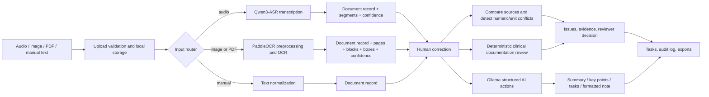

# NoteFlow AI — Hackathon Technical Report

## 1. One-sentence pitch

NoteFlow AI is a local, human-in-the-loop documentation pipeline that converts audio, scanned documents, and manual text into reviewable, comparable, auditable clinical documentation artifacts.

This is documentation support, not diagnosis or treatment. A reviewer must approve the output.

## 2. The problem

Important information arrives in incompatible forms: spoken notes, scanned prescriptions or lab results, PDFs, and manually typed notes. A useful AI application must do more than generate text. It must preserve source evidence, show uncertainty, detect disagreements, create follow-up work, and keep an audit trail.

## 3. Core technology

The core technology is a multimodal orchestration pipeline, not a single model:

| Layer | Technology | Responsibility |
|---|---|---|
| Audio understanding | Qwen3-ASR-0.6B through the Mega-ASR/Qwen runtime | Speech-to-text, language-aware transcription, confidence metadata |
| Document understanding | PaddleOCR PP-OCRv6 detection and recognition models | PDF/image rendering, preprocessing, text blocks, bounding boxes, confidence |
| Language intelligence | Local Ollama `qwen3:4b` | Structured summarization, translation, key points, task extraction, note formatting |
| Verification | Python deterministic rules | WER/CER, token and numeric/unit mismatch checks, clinical documentation rules |
| Application platform | FastAPI, SQLAlchemy, Alembic, SQLite | APIs, persistence, migrations, validation, audit events |
| User experience | React, TypeScript, Vite, Tailwind/shadcn-style components | Upload, review, compare, clinical-review, task and export workflows |

The design deliberately combines specialized models with deterministic software. Models interpret messy inputs; rules enforce repeatability and safety boundaries.

## 4. End-to-end pipeline: how I do this



### Runtime sequence

1. The React client submits a file or note to FastAPI.
2. The backend validates extension, size, customer context, and storage path.
3. Audio is routed to ASR; images/PDFs are rendered and routed to OCR; manual text bypasses model inference.
4. The result is normalized into one `Document` entity. ASR adds timed segments; OCR adds pages and positioned blocks.
5. The reviewer edits or accepts the source text. The source, correction, model metadata, and confidence remain available.
6. The compare service calculates WER, CER, token differences, and number/unit mismatches between sources.
7. Clinical rules identify missing allergies, medication conflicts, contradictory values, low-confidence content, and follow-up gaps.
8. Ollama can run constrained JSON operations using a system prompt, user text, JSON schema, temperature 0, and `think=false`.
9. Issues become review decisions and tasks. Mutations are recorded in audit logs.
10. The user exports TXT, JSON, PDF, SRT, VTT, or a customer report.

## 5. Why this is genuinely multimodal

The application accepts three different information modalities and preserves their provenance:

- Audio: transcript plus segment timing and confidence.
- Visual documents: OCR text plus page number, bounding box, image dimensions, and confidence.
- Text: manual notes or normalized output.

The comparison stage makes the modalities useful together. For example, a spoken medication dose can be compared with a scanned prescription, with a numeric mismatch surfaced for human confirmation instead of silently choosing one source.

## 6. AI prompt and structured-output strategy

Every generative operation is constrained by three controls:

1. A task-specific system instruction: use only supplied evidence, do not invent facts, preserve clinical meaning.
2. A JSON schema supplied to Ollama's structured-output format.
3. Deterministic decoding settings: `temperature: 0`, non-streaming response, and explicit model/version metadata.

Example prompt pattern:

```text
SYSTEM:
You are a documentation assistant. Use only the supplied text.
Do not invent facts, diagnoses, medications, or treatment decisions.
Return only JSON that conforms to the provided schema.

USER:
<normalized source text>
```

Task-specific prompts include:

- Summarize faithfully without adding facts.
- Extract at most ten clinical key points from supplied text.
- Extract explicit follow-up tasks only; include evidence for every task.
- Format the note without changing clinical meaning.
- Translate without adding or removing facts.

The output is an assistant suggestion. The deterministic review layer and human reviewer remain authoritative.

## 7. Important implementation details

- FastAPI routes group the system into customers, documents, processing, compare, clinical review, tasks, AI tools, exports, and health.
- SQLAlchemy models persist customers, documents, ASR segments, OCR pages/blocks, analyses, issues, tasks, exports, and audit logs.
- Alembic provides schema migrations.
- Local SQLite is the default; the schema is designed to move toward PostgreSQL.
- File paths are sanitized and constrained inside configured upload/export directories.
- Customer-context checks prevent cross-customer document, task, issue, and export access when context is supplied.
- `/health` reports ASR/OCR configuration and Ollama reachability/model availability.
- `OLLAMA_KEEP_ALIVE=30m` reduces repeated local model cold starts.
- Text fallbacks exist for API testing, but production should disable them and require real model inference.

## 8. What is verified versus what must be stated honestly

Verified in this workspace:

- FastAPI workflow, persistence, validation, deterministic comparison and clinical checks, tasks, exports, ownership checks, and audit logging.
- Backend test suite: `10 passed` on 2026-07-18.
- Configured model integration points and structured Ollama request format.

Not verified as a completed production capability in this workspace:

- Real Qwen ASR inference with the external checkpoint.
- Real PaddleOCR inference with installed PP-OCRv6 checkpoints.
- Live Ollama generation with `qwen3:4b`.
- Full browser E2E coverage for every UI workflow.

For the hackathon demo, label fallback outputs as fallback outputs. Do not claim a model ran when the health endpoint or metadata says it did not.

## 9. Demo script

1. Open the React dashboard.
2. Create/select a customer.
3. Add one manual note and one audio or OCR sample.
4. Show the normalized document and confidence/source metadata.
5. Run compare and point to a numeric/unit mismatch.
6. Run clinical review and show an issue with evidence.
7. Accept, reject, or defer the issue; show the resulting task.
8. Run one structured AI action such as summary or explicit task extraction.
9. Export the final artifact and open the activity/audit history.
10. Close with the safety boundary: AI accelerates documentation review; a human approves the record.

## 10. Hackathon value proposition

The differentiator is controlled multimodal reconciliation. Many demos stop at transcription or summarization. NoteFlow AI connects ingestion, provenance, cross-source comparison, deterministic safety checks, human review, task creation, and export into one inspectable workflow that can run locally.

## 11. Next engineering steps

1. Install and verify the Qwen ASR and PaddleOCR checkpoints; capture latency and accuracy benchmarks.
2. Install Ollama and verify `qwen3:4b` structured responses against schema tests.
3. Finish wiring all review-screen actions to backend APIs.
4. Add authenticated multi-user authorization and stronger MIME/content validation.
5. Add browser E2E tests and a benchmark set for ASR, OCR, mismatch detection, and structured generation.
6. Add confidence calibration, model version tracking, redaction, retention policy, and clinician sign-off controls.

## 12. Master prompt for generating the presentation

```text
Create a 10–12 slide technical hackathon presentation for NoteFlow AI, a local multimodal clinical documentation-support prototype.

Audience: AI application judges and technical reviewers.
Goal: explain exactly how the system is built, what the core technology is, and why the pipeline is useful.

Required slides:
1. Problem and users
2. One-sentence solution
3. Multimodal architecture
4. End-to-end pipeline from upload to export
5. Core technology: Qwen3-ASR, PaddleOCR, Ollama qwen3:4b, FastAPI, React, SQLAlchemy
6. Data model and provenance
7. Structured prompting and JSON-schema control
8. Cross-source comparison and deterministic safety checks
9. Human-in-the-loop review, tasks, audit log, and exports
10. Live demo flow
11. Verified capabilities, limitations, and honest model-status disclosure
12. Roadmap and impact

Use this technical message: the core innovation is orchestration of specialized multimodal models with deterministic verification and human review, not a single black-box model.
Explain each step as “input → component → output”. Include one concrete medication-dose mismatch example. State clearly that the product supports documentation and is not a diagnosis or treatment system. Do not claim real inference for a model unless the runtime and checkpoint were verified. Use concise diagrams, implementation-level detail, and speaker notes that answer “how did I build this?”
```

