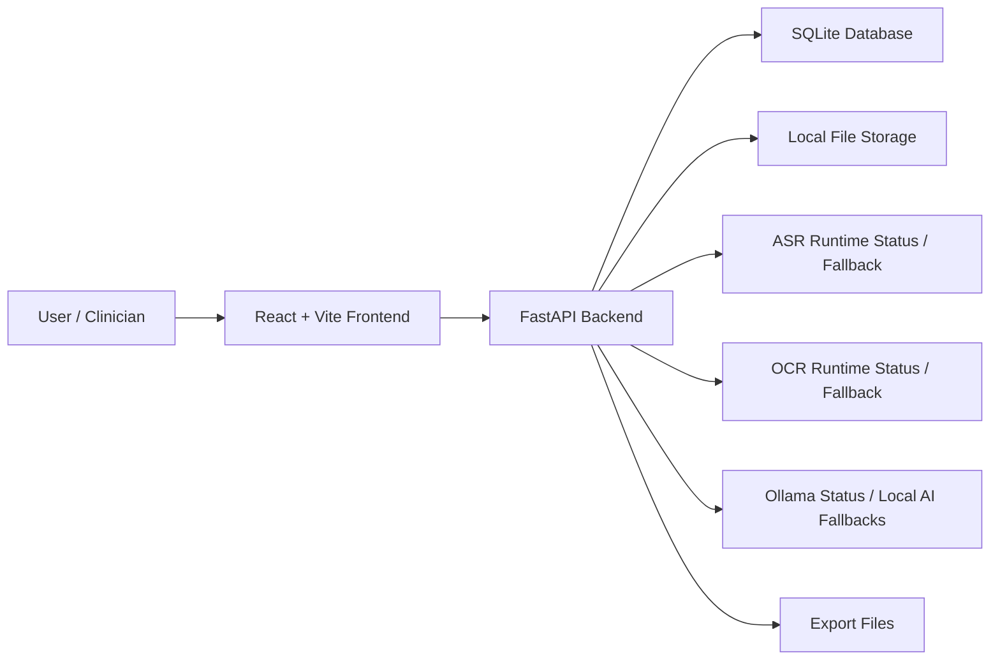
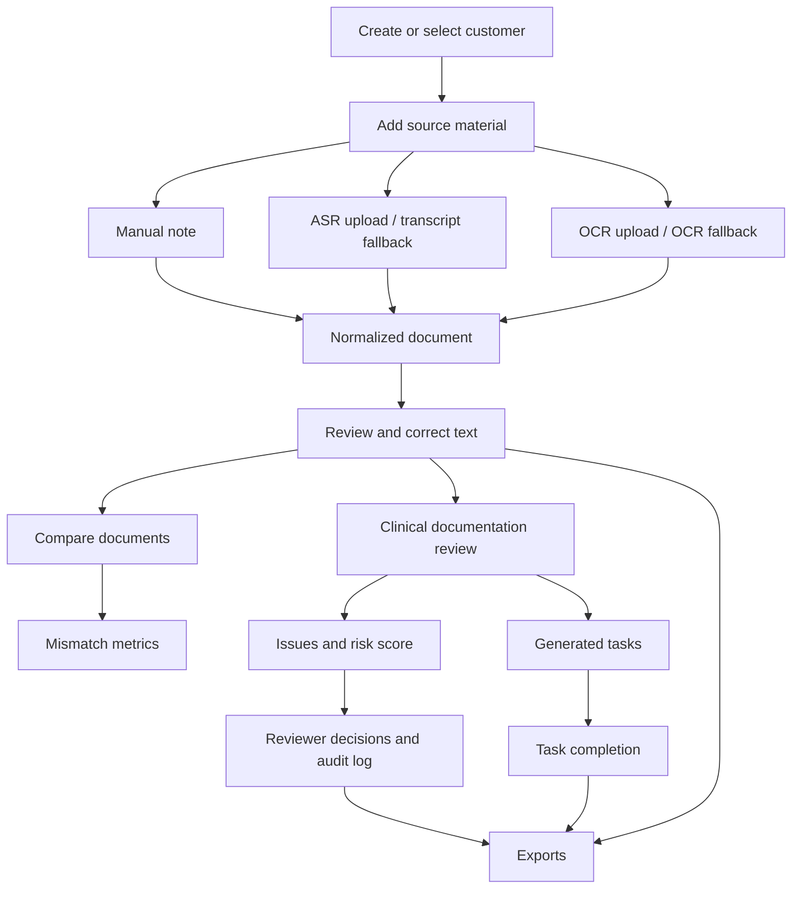
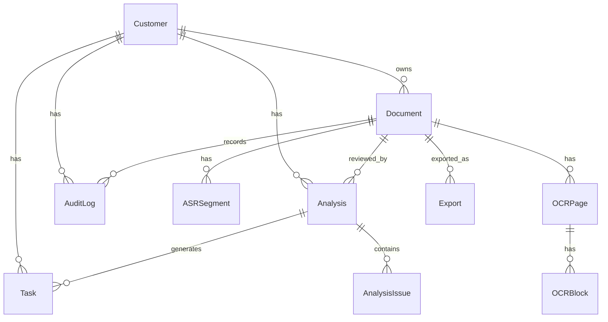

# NoteFlow AI Project Presentation Report

Last reviewed: 2026-07-18

## 1. Executive Summary

NoteFlow AI is a local clinical documentation-support prototype. It helps turn patient-related inputs such as manual notes, audio transcripts, and OCR text into normalized documents that can be reviewed, corrected, compared, analyzed for documentation risks, converted into tasks, and exported.

The project is not a medical diagnosis or treatment system. It is a documentation workflow scaffold that requires clinician review before any real clinical use.

Current implementation status:

- Backend: FastAPI service with SQLAlchemy persistence, Alembic schema migration, document/customer/task APIs, deterministic clinical review rules, text comparison metrics, exports, audit logging, and model health reporting.
- Frontend: React/Vite single-page application with a polished clinical operations UI. Some surfaces are connected to the backend through `Frontend/src/api/client.ts`; several workflow-heavy screens still rely on sample/local UI state.
- Data: Local SQLite database by default, local file storage for uploads and exports.
- Models: Real ASR, OCR, and Ollama inference are configured conceptually but not bundled. ASR/OCR endpoints currently support `.txt` fallback uploads for API testing.
- Verification: Backend test suite passes locally: `10 passed` on 2026-07-18.

## 2. High-Level Architecture



Main idea:

1. The user works in a browser UI.
2. The frontend calls backend endpoints under `/api`.
3. The backend validates input, writes files, creates database records, runs deterministic support logic, and returns normalized responses.
4. The database stores customers, documents, ASR segments, OCR pages/blocks, analyses, issues, tasks, exports, and audit logs.
5. Export endpoints generate downloadable TXT, JSON, PDF, SRT, VTT, or customer report output.

## 3. Repository Structure

```text
NoteFlow AI/
  README.md
  alembic.ini
  backend/
    app/
      main.py
      config.py
      database.py
      models.py
      schemas.py
      serializers.py
      routes/
      services/
    alembic/
      versions/
    tests/
    requirements.txt
  Frontend/
    src/
      app/
        App.tsx
        components/
      api/
        client.ts
      styles/
    package.json
    vite.config.ts
  data/
    uploads/
    exports/
  docs/
  verification/
  repair/
```

Folder roles:

- `backend/`: API, database models, business rules, persistence, upload handling, exports, and tests.
- `Frontend/`: React/Vite application and UI components.
- `data/`: local runtime data such as uploads and generated exports.
- `docs/`: design notes, contracts, known issues, deployment checklist, and this presentation report.
- `verification/`: audit reports, test evidence, API evidence, and verification scripts.
- `repair/`: repair plans, issue logs, and historical repair-tracking documents.

## 4. Main Product Workflow



Step-by-step:

1. Customer management
   - Create, list, search, update, archive, restore, and export customer records.
   - Duplicate warnings are calculated using patient identifiers, medical record number, or name plus date of birth.

2. Document ingestion
   - Manual note: `POST /api/documents/manual`
   - Audio transcription path: `POST /api/transcribe`
   - OCR path: `POST /api/ocr`
   - Current ASR/OCR runtime behavior: `.txt` fallback uploads are accepted for testing; real audio/image/PDF model inference returns a controlled unavailable response.

3. Normalization
   - All inputs become `Document` records.
   - Audio documents include `ASRSegment` rows.
   - OCR documents include `OCRPage` and `OCRBlock` rows.
   - Documents include status, confidence, language, source metadata, raw text, and optional corrected text.

4. Human correction
   - Document text can be corrected.
   - OCR blocks can be corrected individually.
   - Corrections update the document and create audit log records.

5. Comparison
   - Two documents can be compared with WER, CER, simple token differences, and numeric/unit mismatch detection.

6. Clinical documentation review
   - Deterministic rules check for missing allergy information, medication completeness, allergy conflicts, symptom contradictions, follow-up/reassessment gaps, and low-confidence source text.
   - The review creates an `Analysis`, `AnalysisIssue` rows, and follow-up `Task` rows.

7. Task handling
   - Tasks can be listed, created, updated, deleted, and completed.
   - Clinical review can generate tasks automatically from follow-up language in source text.

8. Export
   - Documents can be exported as TXT, JSON, PDF, SRT, or VTT.
   - SRT/VTT are limited to audio documents.
   - Customer reports can be exported as JSON payloads.

9. Audit trail
   - Customer creation/update/archive/restore, document creation/correction/finalization/export, issue decisions, and task changes are recorded in `audit_logs`.

## 5. Backend Structure

Backend entry point:

- `backend/app/main.py`
  - Creates the FastAPI app.
  - Ensures storage directories exist.
  - Creates tables automatically when configured.
  - Adds CORS.
  - Registers route modules.
  - Exposes `/health`.

Configuration:

- `backend/app/config.py`
  - Reads environment variables.
  - Defines database URL, CORS origins, ASR/OCR/Ollama settings, upload/export directories, size limits, and fallback toggles.

Database:

- `backend/app/database.py`
  - Creates SQLAlchemy engine/session.
  - Enables SQLite foreign keys.
  - Provides `get_db()` dependency.

Models:

- `backend/app/models.py`
  - `Customer`
  - `Document`
  - `ASRSegment`
  - `OCRPage`
  - `OCRBlock`
  - `Analysis`
  - `AnalysisIssue`
  - `Task`
  - `Export`
  - `AuditLog`

Schemas:

- `backend/app/schemas.py`
  - Pydantic request/response models.
  - Validation for emails, phone numbers, language codes, document statuses, task statuses, priorities, and clinical review note types.

Serialization:

- `backend/app/serializers.py`
  - Converts ORM `Document` records into API response objects.
  - Sorts ASR segments, OCR pages, and OCR blocks.
  - Safely parses JSON metadata fields.

## 6. Backend API Surface

Customer routes:

- `POST /api/customers`
- `GET /api/customers`
- `GET /api/customers/{customer_id}`
- `PATCH /api/customers/{customer_id}`
- `DELETE /api/customers/{customer_id}`
- `POST /api/customers/{customer_id}/archive`
- `POST /api/customers/{customer_id}/restore`
- `GET /api/customers/{customer_id}/documents`
- `GET /api/customers/{customer_id}/analyses`
- `GET /api/customers/{customer_id}/tasks`
- `GET /api/customers/{customer_id}/exports`
- `GET /api/customers/{customer_id}/activity`
- `GET /api/customers/{customer_id}/export/report`

Document routes:

- `POST /api/documents/manual`
- `GET /api/documents`
- `GET /api/documents/{document_id}`
- `PATCH /api/documents/{document_id}`
- `DELETE /api/documents/{document_id}`
- `PATCH /api/documents/{document_id}/text`
- `POST /api/documents/{document_id}/finalize`
- `PATCH /api/documents/{document_id}/ocr-blocks/{block_id}`
- `POST /api/documents/combine`
- `GET /api/documents/{document_id}/export/{export_type}`

Processing routes:

- `POST /api/transcribe`
- `POST /api/ocr`

Analysis and review routes:

- `POST /api/compare`
- `POST /api/clinical-review`
- `POST /api/issues/{issue_id}/decision`

Task routes:

- `GET /api/tasks`
- `POST /api/tasks`
- `PATCH /api/tasks/{task_id}`
- `DELETE /api/tasks/{task_id}`
- `POST /api/tasks/{task_id}/complete`

AI utility routes:

- `POST /api/ai/summarize`
- `POST /api/ai/translate`
- `POST /api/ai/key-points`
- `POST /api/ai/tasks`
- `POST /api/ai/format-note`

Health:

- `GET /health`

## 7. Service Modules

- `services/storage.py`
  - Sanitizes filenames.
  - Validates file extensions.
  - Enforces upload size limits.
  - Ensures paths remain inside configured storage directories.

- `services/ownership.py`
  - Provides the current customer-context access check.
  - Important limitation: this is not full authentication or authorization.

- `services/metrics.py`
  - Tokenization.
  - Levenshtein distance.
  - Word error rate.
  - Character error rate.
  - Simple token diff.
  - Numerical and unit mismatch detection.

- `services/clinical.py`
  - Deterministic documentation review rules.
  - Risk scoring.
  - Issue generation.
  - Follow-up task extraction.

- `services/exporter.py`
  - Document export to TXT, JSON, PDF, SRT, and VTT.
  - Customer report payload generation.

- `services/ai_tools.py`
  - Ollama status check.
  - Deterministic local fallback responses for summarize, translate, key points, tasks, and note formatting.

- `services/model_status.py`
  - Reports ASR and OCR model configuration/status.

## 8. Data Model Explanation



Key relationships:

- A customer can own many documents, analyses, tasks, and audit logs.
- A document can come from manual text, audio, image/PDF OCR, or a combined document.
- Audio documents store ASR segments with timing and confidence.
- OCR documents store pages and text blocks with bounding boxes and confidence.
- Clinical reviews produce analyses, issues, and tasks.
- Export records track generated output files.
- Audit logs preserve important mutations and reviewer decisions.

## 9. Frontend Structure

Frontend entry points:

- `Frontend/src/main.tsx`
- `Frontend/src/app/App.tsx`
- `Frontend/src/api/client.ts`

The frontend is a React/Vite single-page application. The main app file contains the screen state, navigation, shared UI components, and screen components.

Screens:

- Dashboard
- Customers
- Customer workspace
- New Processing
- Documents
- ASR Review
- OCR Review
- Compare
- Clinical Review
- Batch
- Tasks
- History
- Settings

Connected API client functions:

- `listCustomers`
- `createCustomer`
- `listDocuments`
- `createManualDocument`
- `listTasks`
- `completeTask`

Frontend integration status:

- Implemented backend-backed areas include listing customers/documents/tasks, creating simple customers, creating manual notes, and completing backend tasks.
- Many detailed workflow actions are still local or sample-driven, including real file browsing/upload flows, recording, transcript acceptance, OCR acceptance, exports from review screens, clinical issue decisions from the UI, batch jobs, history export, and settings persistence.

## 10. Deployment and Runtime

Local backend:

```powershell
.\.venv\Scripts\python.exe -m alembic upgrade head
.\.venv\Scripts\python.exe -m uvicorn backend.app.main:app --host 127.0.0.1 --port 8000
```

Local frontend:

```powershell
cd Frontend
pnpm install
pnpm run dev
```

Local API behavior:

- Vite proxies `/api` to `http://127.0.0.1:8000`.

Local execution:

- Container deployment was removed on 2026-07-18.
- Backend runs through the project venv and Uvicorn on port `8000`.
- Frontend runs through pnpm/Vite on port `5173`.

## 11. Model and AI Behavior

Configured components:

- ASR model mode: `qwen-0.6b`
- ASR device: CPU by default
- OCR engine: `paddleocr`
- Ollama model: `qwen3:4b`

Current implementation reality:

- Real Mega-ASR/Qwen ASR inference is not installed in this workspace.
- Real PaddleOCR image/PDF inference is not installed in this workspace.
- ASR/OCR endpoints use `.txt` fallback mode for API testing when fallback settings are enabled.
- Ollama is checked in health status, but utility endpoints have deterministic local fallback behavior.

Presentation framing:

- Present the project as a working workflow scaffold with verified backend behavior.
- Do not present it as a completed real ASR/OCR clinical product until model runtimes are installed, integrated, and verified.

## 12. Security and Safety Notes

Implemented safeguards:

- Extension allowlists for uploads.
- Empty-file and max-size checks.
- Path traversal prevention for stored files and exports.
- Customer-context ownership checks on direct document, task, issue, and export actions when `customer_id` is supplied.
- Email and phone validation through Pydantic.
- Audit logging for key workflow events.
- Explicit clinical-support disclaimer.

Remaining limitations:

- No real authentication system.
- Ownership is based on an optional customer context, not authenticated identity.
- Upload validation is extension-based; MIME/content verification is limited.
- `.txt` fallback for ASR/OCR should be disabled in production.
- Medical safety of OCR/ASR output is not validated against real model accuracy.
- Timestamps use timezone-naive UTC in several places, which produces deprecation warnings.

## 13. Verification Status

Command run during this review:

```powershell
.\.venv\Scripts\python.exe -m pytest backend\tests -q
```

Result:

```text
10 passed, 104 warnings
```

Covered by tests:

- Customer/document/compare/clinical/task/export workflow.
- Cross-customer combine rejection.
- Text fallback ASR/OCR ingestion.
- Issue ignore requires reason.
- Metrics and clinical rule behavior.
- Invalid email rejection.
- Wrong-customer document/task/issue access checks when customer context is provided.
- Customer report excludes other customer records.

Warnings:

- Timezone-aware datetime conversion is complete; the backend test suite reports zero deprecation warnings.

## 14. Important Gaps and Risks

Highest priority:

- Add real authentication and authorization.
- Finish wiring frontend workflow buttons to backend endpoints.
- Integrate and verify real ASR and OCR runtimes.
- Add real browser E2E tests for upload, correction, review, task, and export workflows.

Medium priority:

- Add MIME/content validation for uploads.
- Replace timezone-naive UTC timestamps.
- Add production deployment verification if a non-local deployment target is selected.
- Add richer clinical review logic or verified LLM JSON output if product scope requires it.
- Update older verification documents that no longer match the current source state.

## 15. Suggested Slide Deck

Slide 1: Project Title

- NoteFlow AI
- Local clinical documentation-support prototype
- Goal: convert messy source material into reviewable, auditable documentation artifacts.

Slide 2: Problem

- Clinical notes arrive from audio, scanned documents, PDFs, and manual entry.
- Teams need a workflow to normalize, review, compare, correct, and export information.
- Safety requires audit logs and human review.

Slide 3: Solution Overview

- One frontend workflow.
- One backend API.
- Local database and file storage.
- Structured records for documents, analyses, issues, tasks, and exports.

Slide 4: Architecture

- Show the high-level architecture diagram from section 2.

Slide 5: Repository Structure

- Backend: API and persistence.
- Frontend: React/Vite UI.
- Data: uploads and exports.
- Docs/verification/repair: project evidence and planning.

Slide 6: End-to-End Pipeline

- Show the product workflow diagram from section 4.

Slide 7: Backend API Groups

- Customers.
- Documents.
- Processing.
- Compare.
- Clinical review.
- Tasks.
- AI tools.
- Health.

Slide 8: Data Model

- Show the ER diagram from section 8.
- Explain how all workflows center on the `Document` entity.

Slide 9: Frontend Experience

- Sidebar navigation across dashboard, customers, processing, documents, compare, clinical review, tasks, history, and settings.
- Current API client supports customers, documents, manual notes, tasks, and task completion.
- Some screens still use sample/local behavior.

Slide 10: Clinical Review Logic

- Deterministic checks for allergies, medication completeness, contradictions, follow-up gaps, and low-confidence text.
- Produces risk score, issues, recommendations, and tasks.

Slide 11: Verification

- Backend tests passing: `10 passed`.
- Verified workflows include customer creation, document creation, compare, clinical review, task completion, export, fallback ASR/OCR, and security regression checks.

Slide 12: Current Limitations

- Not a diagnosis/treatment tool.
- Real ASR/OCR runtimes not bundled.
- Frontend workflow wiring is partial.
- No full auth system yet.

Slide 13: Next Roadmap

- Complete frontend-backend wiring.
- Add authentication and stronger authorization.
- Integrate real ASR/OCR/Ollama.
- Add browser E2E tests.
- Harden deployment and validation.

Slide 14: Takeaway

- NoteFlow AI is a strong local scaffold for auditable clinical documentation workflows.
- The backend foundation is test-covered.
- The next step is turning the prototype into a fully wired, model-backed, security-hardened product.
